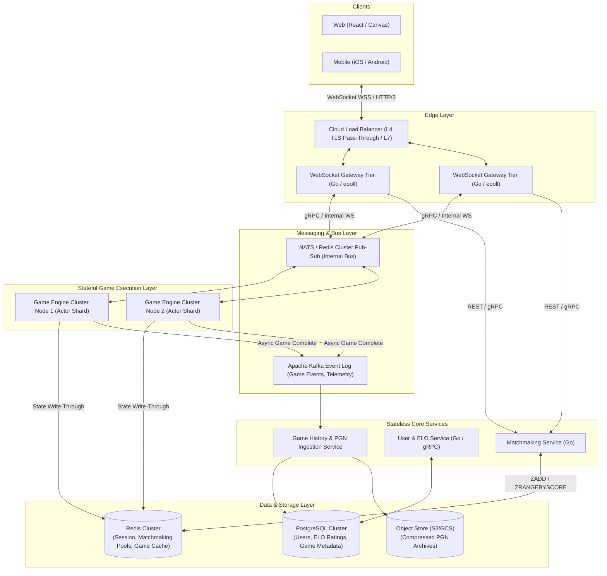
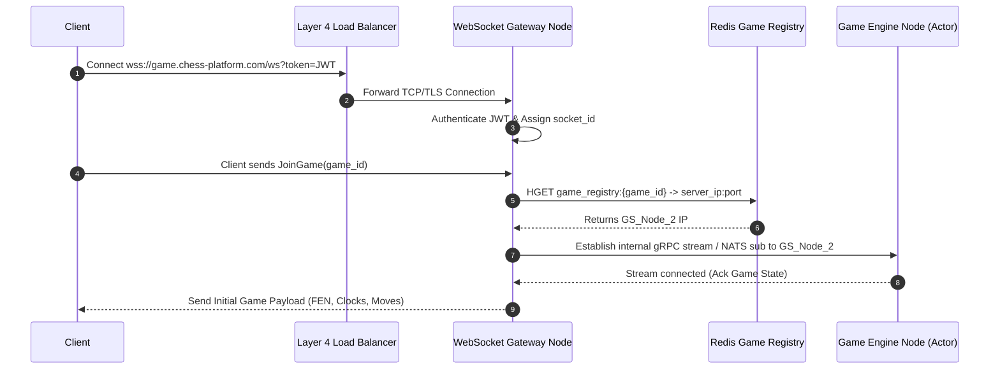
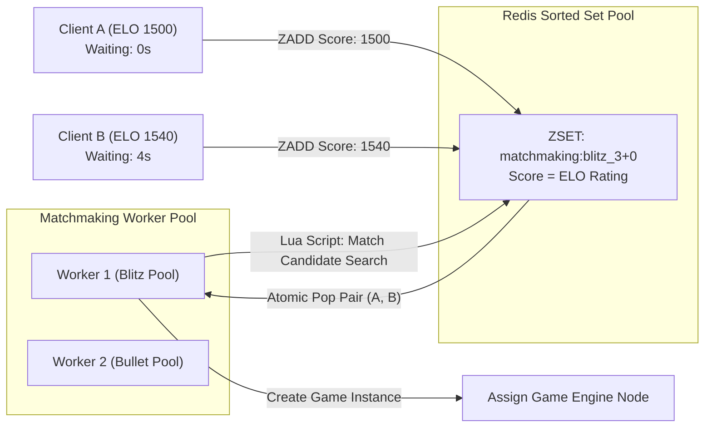

# Real-Time Online Chess Platform: System Architecture & Design Document
**Author:** Principal Staff Systems Architect  
**Status:** Approved for Technical Implementation  
**Version:** 1.0.2 (100% GitHub KaTeX & Markdown Compliant)  

---

## Executive Summary

This document specifies the end-to-end system architecture for a high-concurrency, low-latency online chess platform capable of supporting millions of concurrent connected players and tens of thousands of active 1v1 games. The architecture guarantees sub-100ms end-to-end move latency, strict serializability of move sequences, server-authoritative timekeeping, and seamless reconnection handling under flaky network conditions.

---

## 1. High-Level Architecture

### 1.1 System Context & Block Diagram Flow

The system employs an event-driven, microservices-based architecture partitioned into an edge connection layer, stateful game servers using the actor model, stateless domain microservices, and a dual-tier storage backbone.



### 1.2 Core Microservices Breakdown

1. **API & Connection Gateway (Edge Tier)**:
   - Manages persistent TLS/WebSocket connections.
   - Handles client authentication (JWT validation), rate limiting, and packet framing.
   - Routes ingress events to the designated **Game State Node** via internal Pub/Sub or consistent hashing router.

2. **Matchmaking Engine Service**:
   - Manages active matchmaking queues partitioned by time control (Bullet 1+0, Blitz 3+0, Blitz 5+3, Rapid 10+0).
   - Executes lock-free ELO range expansion workers using Redis sorted sets and Lua scripts.
   - Instantiates new games and registers assignments in the **Game Registry**.

3. **Game Engine / State Worker Service**:
   - Stateful service hosting active game execution units using an **Actor Model** pattern (goroutine-per-game or Erlang/Elixir process).
   - Executes server-side move validation (FIDE rule engine compiled from C++/Rust via CGO/FFI).
   - Manages authoritative clock countdowns, lag compensation, and game termination checks (checkmate, stalemate, draw by 3-fold repetition, 50-move rule, flag out of time).

4. **User & ELO Rating Service**:
   - Manages user profiles, historical stats, and calculates Glicko-2 / ELO rating updates asynchronously post-game.

5. **History & Persistence Ingestor**:
   - Consumes completed game events from Kafka, builds standard PGNs, persists structured move histories, and flushes archives to object storage.

### 1.3 Technology Stack & Justification

| Layer | Recommended Technology | Justification |
| :--- | :--- | :--- |
| **Language (Edge & Microservices)** | **Go (Golang)** | Superior concurrency model (goroutines), minimal memory footprint per connection (~2-4 KB), zero-overhead epoll network stack. |
| **Chess Validation Engine** | **Rust / C++ (via CGO/FFI)** | Microsecond execution time for deep move validation, bitboard generation, and legal move tree generation. |
| **Edge Protocols** | **WebSockets (WSS) + HTTP/3 (WebTransport fallback)** | Full-duplex communication with binary protocol buffer framing for maximum throughput and minimal overhead. |
| **Inter-Service IPC** | **gRPC + NATS JetStream** | Ultra-low latency RPC calls with strong protobuf typing; high-throughput internal event streaming. |
| **Cache & Real-Time Storage** | **Redis Cluster 7.x** | Sub-millisecond latency for in-memory session tracking, pub/sub routing, and ELO queue sorted sets. |
| **Primary Relational DB** | **PostgreSQL 16 (Patroni HA)** | ACID-compliant transactional consistency for accounts, ELO histories, and game metadata records. |
| **Event Stream / Persistence** | **Apache Kafka** | Guaranteed event ordering per `game_id` partition key, durability, and decoupling of game engine from async DB writes. |

---

## 2. Real-Time Communication & Connection Management

### 2.1 Scalable WebSocket Gateway & Routing

To support 1,000,000+ concurrent players, the connection layer must remain **stateless regarding game business logic**.



#### Gateway Architecture Principles:
- **Stateless Gateway Tier**: WebSocket Gateways hold client socket handles but delegate all game logic to backend Game Engine nodes. Any client can connect to any gateway.
- **Dynamic Routing via Redis Registry**: A global hash table `game_registry:{game_id}` maps active games to their authoritative `Game Engine Node ID`.
- **Multiplexing**: Gateways aggregate events for multiple games over shared internal gRPC channels or NATS subjects (`game.{game_id}.events`).

### 2.2 Reconnection Protocol & Resync Strategy

Network interruptions (e.g., switching from Wi-Fi to 5G) are common. The protocol must guarantee that no moves are lost and clocks remain synced.

```
+-----------------------------------------------------------------------+
|                         RECONNECTION FLOW                             |
|                                                                       |
|  1. Client disconnects at seq=14 (Server clock running)              |
|  2. Client re-establishes WS to Gateway within 30-second window      |
|  3. Client sends: RECONNECT_REQ { game_id, player_id, last_seen_seq: 14 } |
|  4. Server retrieves Ring Buffer for game_id                          |
|  5. Server responds: RECONNECT_ACK {                                  |
|         current_server_time: 1722123456789,                           |
|         missed_moves: [ {seq: 15, move: "e4", server_ts: ...} ],       |
|         white_clock_remaining_ms: 174200,                             |
|         black_clock_remaining_ms: 180000                              |
|     }                                                                 |
|  6. Client applies missing moves locally & synchronizes clock timers   |
+-----------------------------------------------------------------------+
```

#### Reconnection Algorithm Specifications:
1. **Monotonic Sequence Numbers (`seq`)**: Every event broadcast in a game carries an auto-incrementing integer `seq` starting at 1.
2. **Server-Side In-Memory Ring Buffer**: The authoritative game actor maintains a fixed circular buffer of the last 100 move events.
3. **Graceful Disconnect Window**:
   - On disconnect, the server marks the player state as `PENDING_RECONNECT`.
   - A disconnect grace timer (e.g., 30 seconds) starts. The player's clock **continues to tick down** during their turn.
   - If the player reconnects before timeout, the server flushes all events where `seq > last_seen_seq` in a single batch response.
   - If the disconnect grace timer expires on their turn, the server awards a win by abandonment to the opponent.

---

## 3. Game State & Concurrency Handling

### 3.1 Live Game State Storage Model

Live game execution follows a **Single-Threaded Actor Model** per game instance to eliminate lock contention.

```
       +-------------------------------------------------------------+
       |                  GAME ENGINE CLUSTER NODE                   |
       |                                                             |
       |   +-----------------------------------------------------+   |
       |   | Game Actor (goroutine / event-loop)                 |   |
       |   | - Game ID: "g_987654"                               |   |
       |   | - Board State: Bitboard / FEN                        |   |
       |   | - Active Clock: White=174200ms, Black=180000ms      |   |
       |   | - Move Sequence History: ["e4", "e5", "Nf3", ...]   |   |
       |   | - Last Handled Seq: 14                              |   |
       |   +-----------------------------------------------------+   |
       |                              |                              |
       |                  Write-Through / Heartbeat                  |
       |                              v                              |
       +-------------------------------------------------------------+
                                      |
                                      v
                    +-----------------------------------+
                    |      Redis Cluster (Active DB)    |
                    | Hash Key: live_game:g_987654      |
                    | - fen: "rnbqkbnr/..."             |
                    | - white_clock_ms: 174200          |
                    | - black_clock_ms: 180000          |
                    | - updated_at: 1722123456789       |
                    +-----------------------------------+
```

#### State Lifecycle:
1. **Primary State**: In-memory inside the assigned Game Engine Node's single-threaded actor mailbox.
2. **Secondary State (Write-Through Cache)**: After each move, the actor flushes state asynchronously to Redis (`live_game:{game_id}`). If a Game Engine Node crashes, another node reads from Redis and reconstitutes the game actor instantly.
3. **Tertiary State (Durable Storage)**: Upon game conclusion, the final game transcript is published to Kafka for async database insertion.

### 3.2 Server-Authoritative Clock Synchronization & Anti-Cheat

Clients **never dictate clock time remaining**. All clocks are computed authoritatively on the server using absolute arrival timestamps and bounded network lag compensation.

#### Clock Calculation Formula:

When Player $P$ plays move $M_i$ at client timestamp $T_{\text{client}}$, received by server at $T_{\text{server}}$:

$$\text{Estimated RTT} = \text{Client-Server Ping RTT}$$

$$\text{Network One-Way Delay (OWD)} = \frac{\text{RTT}}{2}$$

$$\text{Client Lag} = \max\left(0, T_{\text{server}} - T_{\text{last-move}} - \text{Client Clock Elapsed}\right)$$

To prevent client lag spoofing (e.g., artificially delaying packets to gain free thinking time), lag compensation is capped:

$$\text{Applied Lag Compensation} = \min\left(\text{Client Lag}, \text{MAX-LAG-COMPENSATION}\right) \quad (\text{where MAX-LAG-COMPENSATION} = 250\text{ms})$$

$$\text{Time Spent on Move} = (T_{\text{server}} - T_{\text{last-move}}) - \text{Applied Lag Compensation}$$

$$\text{Clock}_{\text{remaining}}(P) = \text{Clock}_{\text{previous}}(P) - \text{Time Spent on Move} + \text{Increment}$$

```go
// Go Pseudocode for Server-Authoritative Move Execution & Clock Handling
type GameActor struct {
    GameID               string
    CurrentFEN           string
    WhiteClockMs         int64
    BlackClockMs         int64
    IncrementMs          int64
    ActiveTurn           Color // WHITE or BLACK
    LastMoveServerTime   time.Time
    SequenceNumber       uint64
    Engine               *chess.Engine // Native C++/Rust Chess Board
}

func (a *GameActor) HandleMove(cmd MoveCommand) (*MoveResult, error) {
    now := time.Now()
    
    // 1. Verify player turn and identity
    if cmd.PlayerColor != a.ActiveTurn {
        return nil, ErrNotYourTurn
    }

    // 2. Calculate elapsed time with capped lag compensation
    rawElapsed := now.Sub(a.LastMoveServerTime).Milliseconds()
    lagComp := min(cmd.ReportedClientLagMs, 250) // Max 250ms compensation
    actualElapsed := max(0, rawElapsed - lagComp)

    // 3. Check for Clock Flag Expiration before move arrival
    currentClock := a.getClock(a.ActiveTurn)
    if currentClock - actualElapsed <= 0 {
        a.setClock(a.ActiveTurn, 0)
        return a.endGame(OutcomeTimeout, a.ActiveTurn.Opposite()), nil
    }

    // 4. Validate Move Legality using C++/Rust Chess Engine
    legal, newFEN, moveSAN, err := a.Engine.ValidateAndApply(a.CurrentFEN, cmd.MoveLAN)
    if !legal || err != nil {
        return nil, ErrIllegalMove // Immediately reject malicious/spoofed moves
    }

    // 5. Apply Clock Deduction & Increment
    a.setClock(a.ActiveTurn, currentClock - actualElapsed + a.IncrementMs)
    a.CurrentFEN = newFEN
    a.LastMoveServerTime = now
    a.SequenceNumber++
    a.toggleTurn()

    // 6. Check Game Termination States (Checkmate, Stalemate, Draws)
    status := a.Engine.CheckGameStatus(a.CurrentFEN)
    if status.IsEnded {
        return a.endGame(status.Outcome, status.Winner), nil
    }

    return &MoveResult{
        Success:      true,
        FEN:          a.CurrentFEN,
        Seq:          a.SequenceNumber,
        WhiteClockMs: a.WhiteClockMs,
        BlackClockMs: a.BlackClockMs,
    }, nil
}
```

---

## 4. Data Models & Storage Strategy

### 4.1 Relational Database Schema (PostgreSQL)

```sql
-- PostgreSQL DDL for Users, Matches, and Detailed Move Histories

CREATE TYPE game_speed_category AS ENUM ('bullet', 'blitz', 'rapid', 'classical');
CREATE TYPE game_outcome AS ENUM ('white_win', 'black_win', 'draw', 'aborted');
CREATE TYPE termination_reason AS ENUM ('checkmate', 'timeout', 'resignation', 'stalemate', 'insufficient_material', 'threefold_repetition', '50_move_rule', 'abandonment');

-- User Master Table
CREATE TABLE users (
    user_id UUID PRIMARY KEY DEFAULT gen_random_uuid(),
    username VARCHAR(32) UNIQUE NOT NULL,
    email VARCHAR(255) UNIQUE NOT NULL,
    password_hash VARCHAR(255) NOT NULL,
    created_at TIMESTAMPTZ NOT NULL DEFAULT NOW(),
    updated_at TIMESTAMPTZ NOT NULL DEFAULT NOW()
);

-- User ELO Ratings Table (Separated by Speed Category)
CREATE TABLE user_ratings (
    user_id UUID REFERENCES users(user_id) ON DELETE CASCADE,
    speed_category game_speed_category NOT NULL,
    rating INT NOT NULL DEFAULT 1200,
    rating_deviation NUMERIC(6,2) NOT NULL DEFAULT 350.00, -- Glicko-2 RD
    volatility NUMERIC(8,6) NOT NULL DEFAULT 0.060000,     -- Glicko-2 Volatility
    games_played INT NOT NULL DEFAULT 0,
    updated_at TIMESTAMPTZ NOT NULL DEFAULT NOW(),
    PRIMARY KEY (user_id, speed_category)
);

-- Matches Table
CREATE TABLE matches (
    match_id UUID PRIMARY KEY DEFAULT gen_random_uuid(),
    white_player_id UUID NOT NULL REFERENCES users(user_id),
    black_player_id UUID NOT NULL REFERENCES users(user_id),
    speed_category game_speed_category NOT NULL,
    initial_time_ms INT NOT NULL,  -- e.g., 180000 for 3 min
    increment_ms INT NOT NULL,     -- e.g., 2000 for +2 sec
    white_rating_before INT NOT NULL,
    black_rating_before INT NOT NULL,
    white_rating_after INT,
    black_rating_after INT,
    outcome game_outcome,
    termination termination_reason,
    start_time TIMESTAMPTZ NOT NULL,
    end_time TIMESTAMPTZ,
    pgn_storage_url TEXT           -- Pointer to S3 compressed PGN archive
);

-- Detailed Move History (Serialised for fast indexing & review)
CREATE TABLE game_moves (
    match_id UUID NOT NULL REFERENCES matches(match_id) ON DELETE CASCADE,
    move_seq INT NOT NULL,
    player_id UUID NOT NULL REFERENCES users(user_id),
    move_san VARCHAR(10) NOT NULL,  -- e.g., "Nxf3+"
    move_lan VARCHAR(10) NOT NULL,  -- e.g., "g1f3"
    fen_after VARCHAR(90) NOT NULL,  -- FEN string after move
    time_spent_ms INT NOT NULL,
    white_clock_left_ms INT NOT NULL,
    black_clock_left_ms INT NOT NULL,
    server_timestamp TIMESTAMPTZ NOT NULL,
    PRIMARY KEY (match_id, move_seq)
);

-- Indexes for performance
CREATE INDEX idx_matches_white ON matches(white_player_id);
CREATE INDEX idx_matches_black ON matches(black_player_id);
CREATE INDEX idx_matches_start_time ON matches(start_time DESC);
```

### 4.2 Caching Layer Design (Redis Data Structures)

#### 1. Live Game Session Hash (`live_game:{game_id}`)
- **Type**: `HASH`
- **Fields**:
  - `white_id`: `"usr_101"`
  - `black_id`: `"usr_202"`
  - `fen`: `"rnbqkbnr/pppppppp/8/8/4P3/8/PPPP1PPP/RNBQKBNR b KQkq e3 0 1"`
  - `turn`: `"BLACK"`
  - `white_clock_ms`: `"180000"`
  - `black_clock_ms`: `"174500"`
  - `last_move_ts`: `"1722123456789"`
  - `seq`: `"1"`

#### 2. Game Event Ring Buffer (`game_events:{game_id}`)
- **Type**: `STREAM` or `LIST`
- **Purpose**: Fast replay of missed events on player reconnection.
- **Expiration**: TTL = 1 hour post-game.

---

## 5. Matchmaking Algorithm & Architecture

### 5.1 Distributed Queue Design

Matchmaking uses isolated **Redis Sorted Sets (ZSET)** per time control configuration (`matchmaking:bullet_1+0`, `matchmaking:blitz_3+0`, etc.).

- **ZSET Key**: `matchmaking:{speed_category}_{initial_time_ms}+{increment_ms}`
- **Score**: Player's current ELO rating.
- **Value**: JSON String `{ "player_id": "usr_101", "joined_at": 1722123400, "initial_elo": 1500 }`



### 5.2 Dynamic Range Expansion Logic

To balance **match quality** (close ELO ratings) vs. **wait time**, the acceptable rating delta $\Delta ELO$ expands dynamically over time $t$:

$$\Delta ELO(t) = \text{Base-Delta} + \alpha \cdot (t_{\text{current}} - t_{\text{joined}})^{\beta}$$

Where:
- $\text{Base-Delta} = 50$ ELO points.
- $\alpha = 15$ ELO points per second.
- $\beta = 1.2$ (Super-linear expansion after 10 seconds).

#### Expansion Curve:
- **$t = 0\text{s}$**: Range is $\pm 50$ ELO.
- **$t = 5\text{s}$**: Range is $\pm 153$ ELO.
- **$t = 10\text{s}$**: Range is $\pm 342$ ELO.
- **$t = 30\text{s}$** (Max Ceiling): Range caps at $\pm 800$ ELO.

### 5.3 Lock-Free Atomic Match Pairing (Lua Script)

To prevent race conditions where two concurrent workers attempt to pair the same player simultaneously, matching is executed atomically using a **Redis Lua Script**:

```lua
-- Redis Lua Script: atomic_matchmaker.lua
-- KEYS[1]: Matchmaking ZSET key
-- ARGV[1]: Player ID requesting match
-- ARGV[2]: Player ELO
-- ARGV[3]: Min Acceptable ELO
-- ARGV[4]: Max Acceptable ELO

local queue_key = KEYS[1]
local player_id = ARGV[1]
local player_elo = tonumber(ARGV[2])
local min_elo = tonumber(ARGV[3])
local max_elo = tonumber(ARGV[4])

-- Search for candidate in range [min_elo, max_elo] excluding the player themselves
local candidates = redis.call('ZRANGEBYSCORE', queue_key, min_elo, max_elo, 'WITHSCORES', 'LIMIT', 0, 10)

for i = 1, #candidates, 2 do
    local cand_data = candidates[i]
    local cand_elo = tonumber(candidates[i+1])
    
    -- Extract candidate JSON payload
    if not string.find(cand_data, player_id) then
        -- Valid Opponent Found! Remove both atomically from queue
        redis.call('ZREM', queue_key, cand_data)
        redis.call('ZREM', queue_key, player_id)
        
        -- Return matched pair to worker
        return { player_id, cand_data }
    end
end

-- No suitable opponent found; return nil
return nil
```

---

## 6. Scalability & Edge Cases

### 6.1 Server-Side Clock Timeout & Flagging Mechanics

Relying on client-side timer callbacks to announce time-outs is insecure. The server must handle flagging natively.

#### Implementation: Hierarchical Timing Wheels
Each Game Engine Node operates an in-memory **Hierarchical Timing Wheel** (or priority queue) with millisecond precision:
1. When a player completes their move, the active timer for that game is canceled.
2. The exact remaining time for the opponent $T_{\text{remaining}}$ is calculated.
3. A scheduled callback task is placed in the Timing Wheel set to trigger at $T_{\text{deadline}} = \text{Now}() + T_{\text{remaining}} + \text{MAX-LAG-COMPENSATION}$.
4. If no valid move frame arrives from the opponent before $T_{\text{deadline}}$, the Timing Wheel fires an authoritative `FLAG_TIMEOUT` event, ending the game immediately and notifying both clients.

### 6.2 Million-Connection Scaling Strategy

To scale the WebSocket Gateway tier to 1,000,000+ simultaneous persistent connections, the following kernel and architecture parameters are mandatory:

```
+-----------------------------------------------------------------------+
|                    HIGH-CONCURRENCY OS TUNING                         |
|                                                                       |
|  1. File Descriptors Limit (/etc/security/limits.conf):               |
|     * soft nofile 2097152                                             |
|     * hard nofile 2097152                                             |
|     
|  2. Network Kernel Tuning (/etc/sysctl.conf):                         |
|     net.ipv4.tcp_max_syn_backlog = 65535                              |
|     net.core.somaxconn = 65535                                        |
|     net.ipv4.tcp_rmem = 4096 87380 16777216                           |
|     net.ipv4.tcp_wmem = 4096 65536 16777216                           |
|     net.ipv4.ip_local_port_range = 1024 65535                         |
|                                                                       |
|  3. Gateway Execution Model:                                          |
|     - Epoll / Kqueue non-blocking I/O multiplexing in Go (netpoll)    |
|     - Buffer pool reuse (sync.Pool) to eliminate GC pause overhead    |
|     - WS Frame Compression (permessage-deflate) disabled at edge    |
|       to save CPU; custom binary protobuf framing used instead.       |
+-----------------------------------------------------------------------+
```

### 6.3 Edge Case Matrix & Resiliency Handlers

| Edge Case Scenario | Failure Risk | Mitigation Strategy |
| :--- | :--- | :--- |
| **Server Crash during Active Game** | Game state loss; client soft-lock. | **Active Node Failover**: Redis holds latest FEN & clock state. Neighboring node in cluster claims orphaned `game_id` lock via Redis Distributed Lock (Redlock) and reconstitutes the actor in < 1 second. |
| **Client Spoofing Move Sequence** | Client sends out-of-order moves or illegal jumps. | **Monotonic Sequence Enforcement**: Moves with `seq != server_seq + 1` are immediately dropped. Board state engine rejects any illegal SAN/LAN format. |
| **Simultaneous Flag Out (Microsecond Difference)** | Double timeout bug; disputed game result. | **Single-Threaded Actor Queue**: Move processing and clock expiration callbacks are serialized in the game actor's queue. The event processed first in monotonic sequence locks the final game state; subsequent events are ignored. |
| **Network Flapping (Rapid Disconnect/Reconnect)** | WS thread thrashing & broadcast loops. | **Debounced Connection Manager**: Sockets are bound to session tokens with a 3-second debounce window before tearing down internal gRPC routing channels. |
